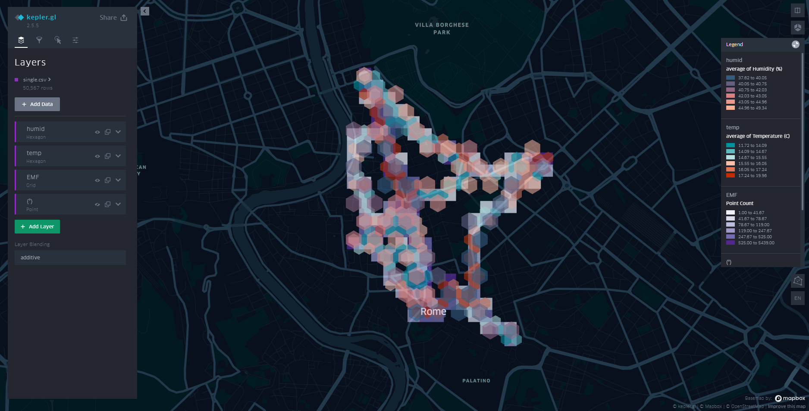
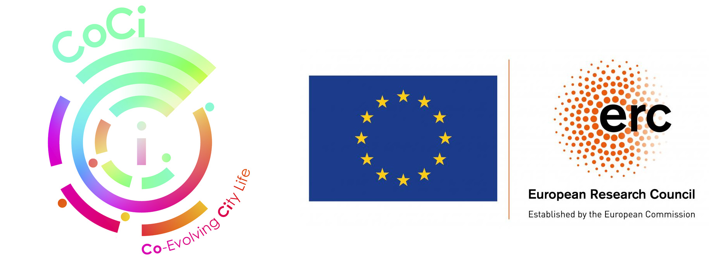

# Urban sensing and data integration at datathink_2023
*Created by Javier Argota Sánchez-Vaquerizo* 
javier.argota@gess.ethz.ch

[**Computational Social Science**](https://coss.ethz.ch/) (COSS) at ETH Zürich

27-Feb-2023 for **Datathink 2023**.

Repository for workshop on days 1 and 2.

## Basic description

The repository contains some examples of urban sensing from different sources to illustrate data integration and data fusion approaches and limitations. 

This data integration pipeline results in data ready to be visualized on Kepler.gl as part of the stack of data collected during Datathink 2023 in Rome. 

The collected data consists of measurements of:
- Air quality (temperature, humidity, PM1, PM2.5 and PM10) with the Co-Sense unit.
- Location data collected with activity trackers and smartphones using the GeoTracker app.
- Radio-frequency (RF), electro-magnetic field (EMF), and electric field (EF) intensity captured with the GQ EMF-390 multimeter.

## Usage

In each folder:
- Examples of the mentioned data sources are included, with a notebook (.ipynb file) for the data processing and creation of a new integrated csv file.

- This csv file can be imported in Kepler.gl for visualization purposes.

- Finally, the map can be exported in json and html format.

Folder ***test_roma_20230228*** contains the most complete version of the pipeline with the data collected by participants in Datathink.

Two possible usages:

a.

- Clone or download the repo.
- [Install Jupyter notebook / Jupyter lab in your local machine](https://jupyter.org/install).
- Run the notebook.

b.

- Open [Google Colab](https://colab.research.google.com/).
- Open new notebook and link to this repo: https://github.com/Reivajar/datathink_2023.git
- Open the appropriate notebook. For the Rome version, open ***data_fusion_v4.ipynb***.
- Download the csv generated files to your local machine directly from Colab files manager (panel on the left side of the browser).

## Acknowledgments

The Co-Sense unit has been designed by Dr. Sachit Mahajan (sachit.mahajan@gess.ethz.ch) at the Chair Computation Social Science as part of the [Co-Evolving City Project (CoCi)](https://coss.ethz.ch/research/CoCi.html) which has received funding from the European Research Council (ERC) under the European Union’s Horizon 2020 re- search and innovation programme under grant agreement No. 833168. Javier Argota Sánchez-Vaquerizo's research is as well supported by CoCi (ERC grant).

Datathink is a graduate seminar on space and digitazion organized by organized by the UNESCO Chair in Urban Landscape at Université de Montréal in collaboration with Digital Visual Studies at Universität Zürich, and the Max-Planck Society and Biblioteca Hertziana in Rome.